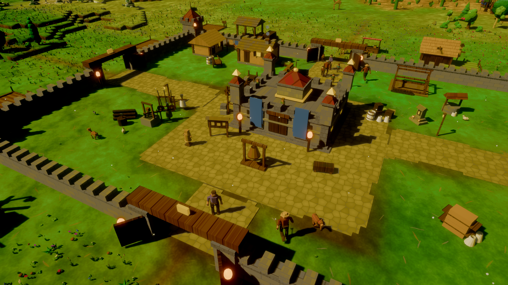
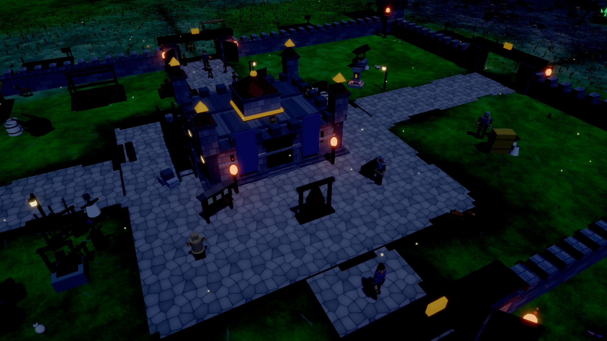
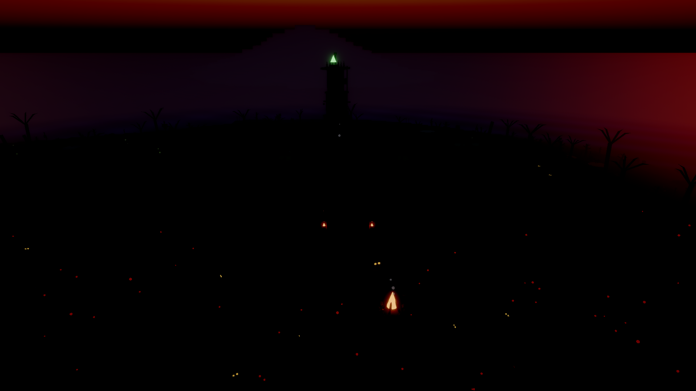
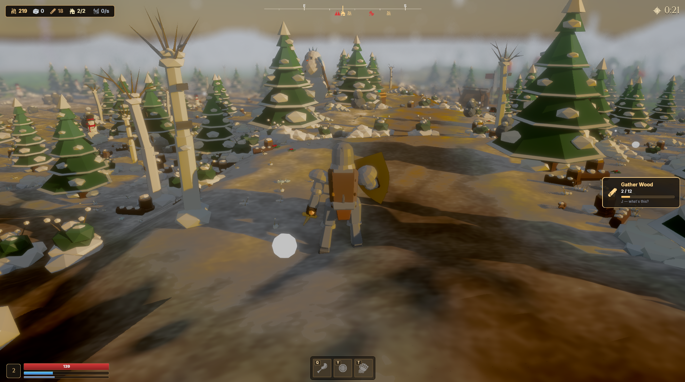
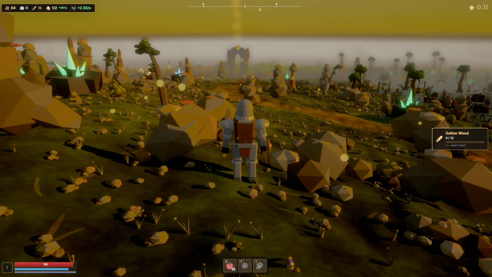
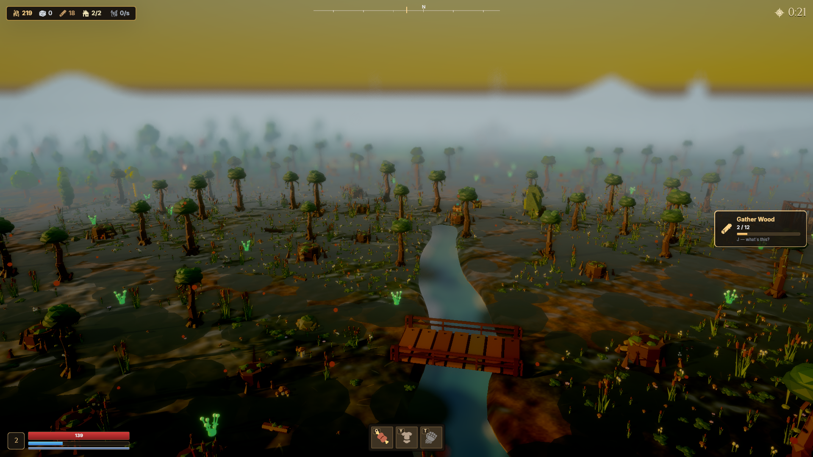

<div align="center">

# ⚔️ Warbell

**Defend the keep against nightly ork sieges.**

A knight holds a central castle through wave after wave of night assaults across a
five-biome island — real-time combat, an economy and upgrade tree, a town you build and
defend, inventory and consumables, villagers, wildlife, and a bloodline succession loop.
Built in Rust on [**Bevy 0.18**](https://bevyengine.org).

[**▶ Website**](https://miskibin.github.io/warbell/) · [**⬇ Download for Windows**](https://github.com/miskibin/warbell/releases/latest/download/Warbell-Setup.msi) · [**Changelog**](https://miskibin.github.io/warbell/changelog.html)

<a href="https://miskibin.itch.io/warbell"></a>


</div>

## Play

- **Windows:** download [**`Warbell-Setup.msi`**](https://github.com/miskibin/warbell/releases/latest/download/Warbell-Setup.msi) and run it. The installer is self-signed, so Windows SmartScreen shows "Unknown Publisher" — click **More info → Run anyway**.
- **itch.io:** [**miskibin.itch.io/warbell**](https://miskibin.itch.io/warbell) — Windows & Linux builds, pushed automatically on every release (works with the [itch.io app](https://itch.io/app) for auto-updates).
- **From source** (any platform): see [Build from source](#build-from-source) below.

|  |  |  |
|---|---|---|
|  |  |  |
|  |  |  |
|  |

## Controls

- **WASD / arrows** move · **Space** jump · **Shift** sprint · **LMB** attack · **RMB** block
- **V** / the HUD **FP** button — toggle first-person view
- **E** contextual interact — walk up to the keep (upgrades), a merchant stall (shop), the
  war bell (ring in the night), or a chest (open it) and a prompt names it
- **B** build mode — at your town, press **B**, then point and click to raise houses, farms,
  woodcutters and mines
- **Tab / I** satchel · **Q** eat food · **Y / T** quick-slots · **Z / X / C** combat arts
- **F** forage / rescue · **R** recruit · **` (backquote)** free-roam fly-cam · **P / Esc** pause
- **F1** debug tuning panel · **F2** perf/state overlay · **1–5** swap biome patch

## Build from source

```bash
cargo run        # build + open the game window
cargo test       # run the crates/core parity tests (the validation spec)
cargo check      # type-check without the (slow) link
```

On a fresh Linux box you need Bevy's system libraries once before the first build:

```bash
sudo apt-get update && sudo apt-get install -y \
  libwayland-dev libxkbcommon-dev libudev-dev libasound2-dev
```

(macOS / Windows need none of this.) The first build is slow — `bevy` compiles at
`opt-level = 3` even in dev so the scene isn't single-digit FPS — but incremental rebuilds of
`src/` are fast.

## Architecture

Two crates:

- **`crates/core` (`tileworld_core`)** — pure, deterministic, zero-dependency game logic
  (`f64` throughout). Pathfinding (A*), the wave director, upgrade / buff / resource /
  inventory stores, ork & animal config, factions, RNG, the shop catalog. This is the
  unit-tested validation spec — `cargo test` runs it. No Bevy, no I/O, no rendering.
- **`tileworld_bevy_forest` (root `src/`)** — the Bevy app: rendering, ECS systems, input, the
  scene. It imports `tileworld_core` for all the numbers/logic that must stay correct, wrapping
  core's stores as Resources (`PlayerRes`, `Bank`, `Inventory`, …).

Each `src/<feature>.rs` is a self-contained `Plugin`; **`main.rs` is the assembly list** — read
it as the table of contents. The whole world-sim is gated behind a freeze-gate state machine
(`game_state.rs`): opening any panel or leaving `Playing` freezes the sim but keeps rendering.

See **[`CLAUDE.md`](CLAUDE.md)** for the full conventions (coordinate frame, despawn-race rules,
mesh-building contract, combat-number parity) and **`docs/superpowers/specs/`** for the
per-subsystem roadmap and design docs.

## Screenshot harness

The Bevy window can't be captured externally, so visuals are verified via a render-and-exit
harness:

```bash
# PowerShell
$env:FOREST_SHOT="shot.png"; cargo run
# bash
FOREST_SHOT=shot.png cargo run
```

It renders ~90 frames so lighting/IBL settle, saves the PNG, and exits. Stage the shot with
env vars read at startup: `FOREST_CAM` / `FOREST_TIME` (camera pose / time-of-day),
`FOREST_BIOME` (boot into a biome), `FOREST_WAVE` / `FOREST_DEFEND=1` (stage a night siege),
`FOREST_MENU=1` (start screen), `FOREST_PANEL=tree|inv|build` (open a UI panel),
`FOREST_FP=1` (first-person), `FOREST_EQUIP="sword_gold,gold_armor"` (equip items on the hero).
`BEVY_ASSET_ROOT` points at this dir if you run the binary from elsewhere.

## License

Warbell's **source code** is **source-available** under the
[PolyForm Noncommercial License 1.0.0](LICENSE) — read, build, run, modify, and share it for
**non-commercial** purposes; commercial use is reserved. The **assets** under `assets/` carry
their own terms (e.g. [game-icons.net](https://game-icons.net) icons under CC BY 3.0, the
Cinzel / EB Garamond fonts under the SIL Open Font License; audio and other art may be
separately licensed). See [`LICENSE`](LICENSE) for the full text and the asset note.
